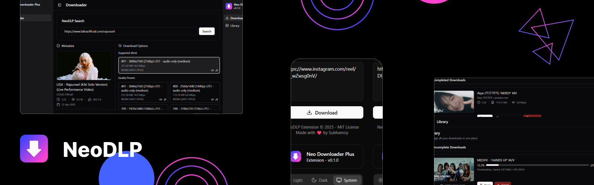

# NeoDLP - (Neo Downloader Plus)

Cross-platform Video/Audio Downloader Desktop App with Modern UI and Browser Integration

[](https://github.com/neosubhamoy/neodlp)
[](https://github.com/neosubhamoy/neodlp)
[](https://github.com/neosubhamoy/neodlp/releases)
[](https://github.com/neosubhamoy/neodlp)

> **🥰 Liked this project? Please consider giving it a Star (🌟) on github to show us your appreciation and help the algorythm recommend this project to even more awesome people like you!**

[](https://repology.org/project/neodlp/versions)

### ✨ Highlighted Features

- Download Video/Audio from popular sites (YT, FB, IG, X and other 2.5k+ [supported sites](https://github.com/yt-dlp/yt-dlp/blob/master/supportedsites.md))
- Download Video/Audio in your preffered format (MP4, WEBM, MKV, MP3 etc.)
- Supports both Video and Playlist download
- Supports Combining Video, Audio streams of your choice
- Supports Multi-Language Subtitle/Caption (CC) embeding
- Different Video/Audio metadata embeding options (info, chapters, thumbnail etc.)
- SponsorBlock support (mark/remove video segments)
- Network controls (proxy, rate limit etc.)
- Highly customizable and many more...😉

### 🧩 Browser Integration

You can integrate NeoDLP with your favourite browser (any Chrome/Chromium/Firefox based browser) Just, install [NeoDLP Extension](https://github.com/neosubhamoy/neodlp-extension) to get started!

After installing the extension you can do the following directly from the browser:

- Quick Search (search current browser address with NeoDLP) (via pressing keyboard shortcut `ALT`+`SHIFT`+`Q`, You can also change this shortcut key combo from browser settings)

- Right Click Context Menu Action (Download with Neo Downloader Plus - Link, Selection, Media Source)

### 👀 Sneak Peek



### 💻 Supported Platforms

- Windows (10 / 11)
- Linux (Debian / Fedora / Arch Linux base)
- MacOS (>11)

> ⚠️ **NOTE:** Though most linux (debian/fedora/arch base) distros are supported but not all packages are tested on all these platforms, to save some time (and brain cells) and ship the software as fast as possible! (Currently only the debian package is tested on Ubuntu 24.04 LTS - So, other linux packages may have issues, test it yourself and feel free to report issues if you found one)

### 🤝 External Dependencies

- [YT-DLP](https://github.com/yt-dlp/yt-dlp) - The core CLI tool used to download video/audio from the web (Hero of the show 😎)
- [FFmpeg & FFprobe](https://www.ffmpeg.org) - Used for video/audio post-processing
- [Aria2](https://aria2.github.io) - Used as an external downloader for blazing fast downloads with yt-dlp (Not included with NeoDLP MacOS builds)
- [Deno](https://deno.com) - Provides sandboxed javascript runtime environment for yt-dlp (Required for YT downloads, as per the new yt-dlp [announcement](https://github.com/yt-dlp/yt-dlp/issues/14404))

### ⬇️ Download and Installation

1. Download the latest [NeoDLP](https://github.com/neosubhamoy/neodlp/releases/latest) release based on your OS and CPU Architecture, then install it! -OR- Install it directly from an available distribution channel (listed below)

| Arch\OS | Windows | Linux | MacOS |
| :----        | :----   | :---- | :---- |
| x86_64 | ✅ [Download](https://github.com/neosubhamoy/neodlp/releases/latest) | ✅ [Download](https://github.com/neosubhamoy/neodlp/releases/latest) | ✅ [Download](https://github.com/neosubhamoy/neodlp/releases/latest) |
| ARM64 | ✅ Emulation | ✅ [Download](https://github.com/neosubhamoy/neodlp/releases/latest) | ✅ [Download](https://github.com/neosubhamoy/neodlp/releases/latest) |

> 📌 **NOTE:** x86_64 Windows binary also works on ARM64 (Windows on ARM) devices with emulation (Not planning to release native Windows ARM64 build anytime soon as, x86_64 one works fine on ARM64 without noticeable performance impact)

| Platform (OS) | Distribution Channel | Installation Command / Instruction |
| :---- | :---- | :---- |
| Windows x86_64 / ARM64 | WinGet | `winget install neodlp` |
| MacOS x86_64 / ARM64 | Curl-Bash Installer | `curl -sSL https://neodlp.neosubhamoy.com/neodlp_macos_installer.sh \| bash` |
| Linux x86_64 (Arch Linux) | AUR | `yay -S neodlp` |

### 💝 Support the Development

NeoDLP is and will be always FREE to Use and Open-Sourced for Everyone. On the other hand the developent process of NeoDLP takes lots of time, effort and even sometimes money! So, if you appriciate my work and have the ability to donate, then please consider supporting the development by donating (even a very small donation matters and helps NeoDLP to be a better product!) Your support is the key to my motivation...🤗

<a href="https://buymeacoffee.com/neosubhamoy" target="_blank" title="buymeacoffee">
    
</a>
<br></br>

> 📌 **NOTE:** You can also donate via UPI by sending donations to this UPI ID directly: **subhamoybiswas636-2@oksbi**

### 🪜 Roadmap

- [x] Add support for yt-dlp
- [x] Add basic settings and customization
- [x] Integrate with browsers
- [x] Add aria2c support
- [ ] Add more advanced settings and achive stability **(ongoing)**
- [ ] Add media converter
- [ ] Add multiple downloader engines
- [ ] Add advanced web extractor
- [ ] Add more cool stuffs 😉

### ⚡ Technologies Used


### 🛠️ Contributing / Building from Source

Want to be part of this? Feel free to contribute...!! Pull Requests are always welcome...!! (^_^) Follow these simple steps to start building:

* Make sure to install [Rust](https://www.rust-lang.org/tools/install), [Node.js](https://nodejs.org/en), [Git](https://git-scm.com/downloads) and [Git-LFS](https://git-lfs.com/) before proceeding.
* Install [Tauri Prerequisites](https://v2.tauri.app/start/prerequisites/) for your OS / platform
1. Fork this repo in your github account.
2. Git clone the forked repo in your local machine.
3. Create a git branch (related to the feature you are working on) (Optional - Recommended)
4. Install Node.js dependencies: `npm install`
5. Run development / build process
> ⚠️ **IMPORTANT:** Make sure to run the build command once before running the dev command for the first time to avoid compile time errors
```code
# for windows users
npm run tauri dev      # for development
npm run tauri build      # for production build

# for linux users
npm run tauri dev -- --config "./src-tauri/tauri.linux-aarch64.conf.json"     # for ARM64 devices, development
npm run tauri build -- --config "./src-tauri/tauri.linux-aarch64.conf.json"     # for ARM64 devices, production build

npm run tauri dev -- --config "./src-tauri/tauri.linux-x86_64.conf.json"     # for x64 devices, development
npm run tauri build -- --config "./src-tauri/tauri.linux-x86_64.conf.json"     # for x64 devices, production build

# for macOS users (based on cpu architecture)
npm run tauri dev -- --config "./src-tauri/tauri.macos-aarch64.conf.json"     # for apple silicon macs, development
npm run tauri build -- --config "./src-tauri/tauri.macos-aarch64.conf.json"     # for apple silicon macs, production build

npm run tauri dev -- --config "./src-tauri/tauri.macos-x86_64.conf.json"     # for intel x86 macs, development
npm run tauri build -- --config "./src-tauri/tauri.macos-x86_64.conf.json"     # for intel x86 macs, production build
```
6. Do the changes, Send a Pull Request with proper Description (NOTE: Pull Requests Without Proper Description will be Rejected)

### ⭕ Bug Report

Noticed any Bug? or Want to give me some suggetion? Always feel free to open a [GitHub Issue](https://github.com/neosubhamoy/neodlp/issues). I would love to hear from you...!!

### 💫 Credits

- NeoDLP's 'Format Selection' options are inspired from the [Seal](https://github.com/JunkFood02/Seal) app by [@JunkFood02](https://github.com/JunkFood02)
- Aria2 Windows x86_64 and Linux x86_64 static binaries are built by [@asdo92](https://github.com/asdo92/aria2-static-builds)

### 📝 License

NeoDLP is Licensed under the [MIT license](https://github.com/neosubhamoy/neodlp/blob/main/LICENSE). Anyone can view, modify, use (personal and commercial) or distribute it's sources without any attribution and extra permissions.

****
An Open Sourced Project - Developed with ❤️ by **Subhamoy**
