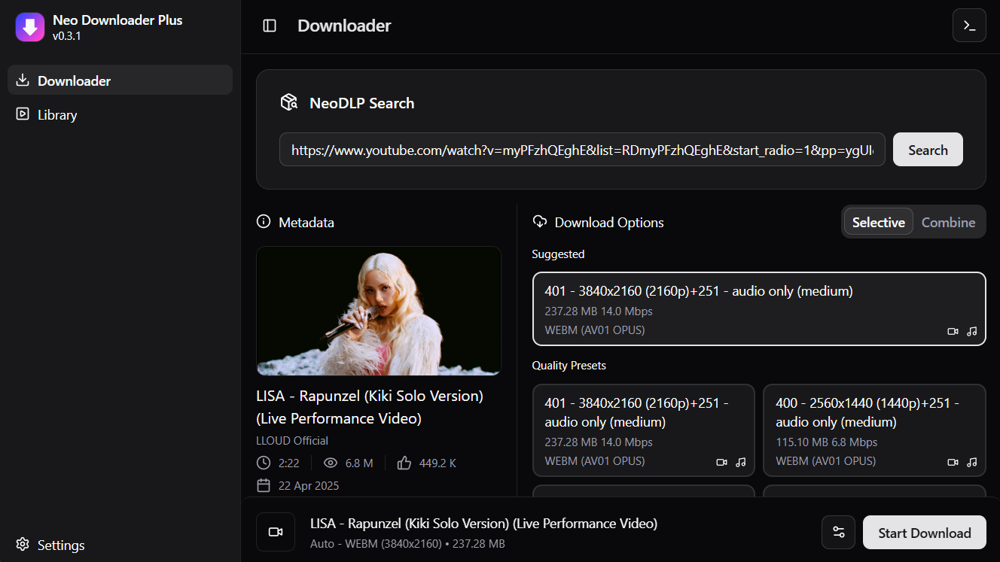
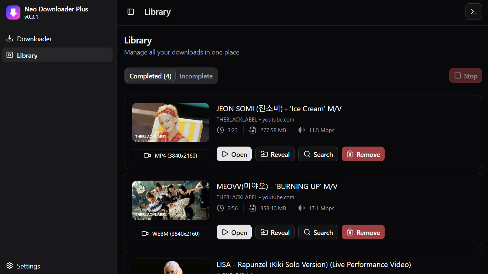
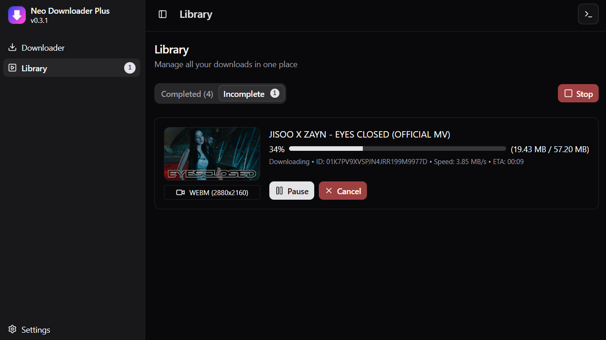
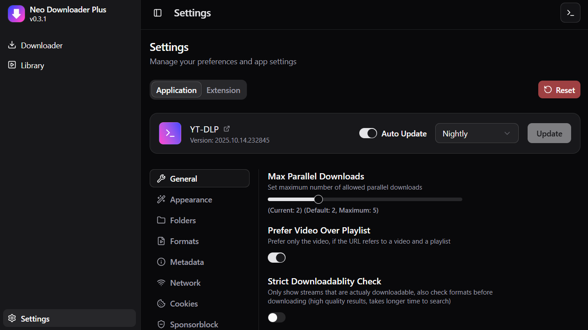

# NeoDLP - Neo Downloader Plus

Cross-platform Video/Audio Downloader Desktop App with Modern UI and Browser Integration

[](https://github.com/neosubhamoy/neodlp/releases/latest)
[](https://github.com/neosubhamoy/neodlp/releases)
[](https://github.com/neosubhamoy/neodlp/stargazers)
[](https://github.com/neosubhamoy/neodlp/blob/main/LICENSE)

> [!TIP]
> **🥰 Liked this project? Please consider giving it a Star (🌟) on github to show us your appreciation and help the algorythm recommend this project to even more awesome people like you!**

[](https://github.com/microsoft/winget-pkgs/tree/master/manifests/n/neosubhamoy/neodlp)
[](https://aur.archlinux.org/packages/neodlp)


## ✨ Highlighted Features

- Download Video/Audio from popular sites (YT, FB, IG, X and other 2.5k+ [supported sites](https://github.com/yt-dlp/yt-dlp/blob/master/supportedsites.md))
- Download Video/Audio in your preffered format (MP4, WEBM, MKV, MP3 etc.)
- Supports both Video and Playlist download
- Supports Combining Video, Audio streams of your choice
- Supports Multi-Lingual Subtitle/Caption (CC) embeding
- Different Video/Audio metadata embeding options (info, chapters, thumbnail etc.)
- SponsorBlock support (mark/remove video segments)
- Network controls (proxy, rate limit etc.)
- Highly customizable and many more...😉

## 🧩 Browser Integration

You can integrate NeoDLP with your favourite browser (any Chromium/Firefox based browser) Just, install [NeoDLP Extension](https://github.com/neosubhamoy/neodlp-extension) to get started!

After installing the extension you can do the following directly from the browser:

- Quick Search (search current browser address with NeoDLP) (via pressing keyboard shortcut `ALT`+`SHIFT`+`Q`, You can also change this shortcut key combo from browser settings)

- Right Click Context Menu Action (Search with Neo Downloader Plus - Link, Selection, Media Source)

## 👀 Sneak Peek


| Downloader | Completed Downloads | Ongoing Downloads | Settings |
| :---- | :---- | :---- | :---- |
|  |  |  |  |

## 💻 Supported Platforms

- Windows (10 / 11)
- Linux (Debian / Fedora / RHEL / SUSE / Arch Linux base)
- MacOS (>11)

## 🤝 External Dependencies

- [YT-DLP](https://github.com/yt-dlp/yt-dlp) [Unlicense] - The core CLI tool used to download video/audio from the web (Hero of the show 😎)
- [FFmpeg & FFprobe](https://www.ffmpeg.org) [LGPLv2.1+] - Used for video/audio post-processing
- [Aria2](https://aria2.github.io) [GPLv2+] - Used as an external downloader for blazing fast downloads with yt-dlp (Not included with NeoDLP MacOS builds)
- [Deno](https://deno.com) [MIT] - Provides sandboxed javascript runtime environment for yt-dlp (Required for YT downloads, as per the new yt-dlp [announcement](https://github.com/yt-dlp/yt-dlp/issues/14404))

## ℹ️ System Pre-Requirements

- **Windows:** [Microsoft Visual C++ Redistributable 2015+](https://learn.microsoft.com/en-us/cpp/windows/latest-supported-vc-redist?view=msvc-170) `winget install Microsoft.VCRedist.2015+.x64` (Will be auto-installed if you install NeoDLP via winget)
- **MacOS:** XCode Command Line Tools `xcode-select --install` (Mostly, comes pre-installed on modern macos, still if you encounter any issue then try installing it manually)
- **Linux:** Most linux packages comes with pre-defined system dependencies which will be auto installed by your package manager (if you are on `fedora` make sure to [enable rpmfusion free+nonfree repos](https://docs.fedoraproject.org/en-US/quick-docs/rpmfusion-setup/#_enabling_the_rpm_fusion_repositories_using_command_line_utilities) before installing the rpm package. also, if you prefer to install dependencies manually [follow this](https://v2.tauri.app/start/prerequisites/#linux))

## ⬇️ Download and Installation

1. Download the latest NeoDLP release based on your OS and CPU Architecture, then install it! -OR- Install it directly from an available distribution channel (listed below)

| Architecture | Windows | Linux | MacOS |
| :----        | :----   | :---- | :---- |
| x86_64 | ✅ [Download](https://github.com/neosubhamoy/neodlp/releases/latest) | ✅ [Download](https://github.com/neosubhamoy/neodlp/releases/latest) | ✅ [Download](https://github.com/neosubhamoy/neodlp/releases/latest) |
| ARM64 | ✅ Emulation | ✅ [Download](https://github.com/neosubhamoy/neodlp/releases/latest) | ✅ [Download](https://github.com/neosubhamoy/neodlp/releases/latest) |

> [!NOTE]
> x86_64 Windows binary also works on ARM64 (Windows on ARM) devices with emulation (Not planning to release native Windows ARM64 build anytime soon as, x86_64 one works fine on ARM64 without noticeable performance impact)

| Platform (OS) | Distribution Channel | Installation Command / Instruction |
| :---- | :---- | :---- |
| Windows x86_64 / ARM64 | WinGet | `winget install neosubhamoy.neodlp` |
| MacOS x86_64 / ARM64 | Curl-Bash Installer | `curl -sSL https://neodlp.neosubhamoy.com/macos_installer.sh \| bash` |
| Linux x86_64 / ARM64 | Curl-Bash Installer | `curl -sSL https://neodlp.neosubhamoy.com/linux_installer.sh \| bash` |
| Arch Linux x86_64 / ARM64 | AUR | `yay -S neodlp` |

## 🧪 Package Testing Status

Though NeoDLP is supported on most platforms but not all packages are tested on all platforms, to save some time (and brain cells) and ship the software as fast as possible! Current test coverage is given below. So, untested packages may have issues, test it yourself and always feel free to report any issue on github.

> [!TIP]
> If you have access to any of the untested systems listed below, you can test the packages there and send me the test results via creating an github issue! (that would be super helpful actualy 😊)

<details>
<summary>Test Coverage</summary>

| Platform | Status | Platform | Status |
| :---- | :---- | :---- | :---- |
| Windows 10 (x64) | ✅ Tested | Windows 10 (ARM64) | ⚠️ Untested |
| Windows 11 (x64) | ✅ Tested | Windows 11 (ARM64) | ✅ Tested |
| MacOS 14 (x64) | ✅ Tested | MacOS 14 (ARM64) | ✅ Tested |
| MacOS 15 (x64) | ⚠️ Untested | MacOS 15 (ARM64) | ✅ Tested |
| MacOS 26 (x64) | ⚠️ Untested | MacOS 26 (ARM64) | ✅ Tested |
| Ubuntu 24.04 LTS (x64) | ✅ Tested | Ubuntu 24.04 LTS (ARM64) | ⚠️ Untested |
| Fedora 42 (x64) | ✅ Tested | Fedora 42 (ARM64) | ⚠️ Untested |
| Arch Linux (x64) | ✅ Tested | Arch Linux (ARM64) | ✅ Tested |
| openSUSE 16 (x64) | ⚠️ Untested | openSUSE 16 (ARM64) | ⚠️ Untested |
| RHEL 10 (x64) | ⚠️ Untested | RHEL 10 (ARM64) | ⚠️ Untested |

</details>

## 💝 Support the Development

NeoDLP is and will be always FREE to Use and Open-Sourced for Everyone. On the other hand the developent process of NeoDLP takes lots of time, effort and even sometimes money! So, if you appriciate my work and have the ability to donate, then please consider supporting the development by donating (even a very small donation matters and helps NeoDLP to be a better product!) Your support is the key to my motivation...🤗

<a href="https://buymeacoffee.com/neosubhamoy" target="_blank" title="buymeacoffee">
    
</a>
<br></br>

> [!NOTE]
> You can also donate via UPI by sending donations to this UPI ID directly: **subhamoybiswas636-2@oksbi**

## 🪜 Roadmap

- [x] Add support for yt-dlp
- [x] Add basic settings and customization
- [x] Integrate with browsers
- [x] Add aria2c support
- [x] Add custom command support
- [x] Add full-playlist/batch download support
- [ ] Improve browser integration **(ongoing)**
- [ ] Implement NeoDLP API
- [ ] Build web interface
- [ ] Implement plugin system
- [ ] Add more cool stuffs 😉

## ⚡ Technologies Used

[](https://tauri.app)
[](https://rust-lang.org)
[](https://react.dev)
[](https://www.typescriptlang.org)
[](https://ui.shadcn.com)

## 🛠️ Building from Source

Want to build/compile NeoDLP from the source code? Follow these simple steps to create a production build:

* Make sure to install [Rust](https://www.rust-lang.org/tools/install), [Node.js](https://nodejs.org/en), and [Git](https://git-scm.com/downloads) before proceeding.
* Install [Tauri Prerequisites](https://v2.tauri.app/start/prerequisites/) for your OS / platform
1. Clone this repo in your local machine: `git clone https://github.com/neosubhamoy/neodlp.git`
2. Go inside the cloned project directory: `cd neodlp`
3. Install Node.js dependencies: `npm install`
4. Download required external binaries (for your platform): `npm run download`
5. Run build process (run the command based on your platform and architecture)
```shell
# command for windows users
npm run tauri build                 # for both x64/ARM64 devices

# commands for linux users
npm run tauri:build:linux-x64       # for x64 devices
npm run tauri:build:linux-arm64     # for ARM64 devices

# commands for macOS users
npm run tauri:build:macos-arm64     # for apple silicon macs
npm run tauri:build:macos-x64       # for intel x86 macs
```
6. Give it the time to compile (~5-10min) (if you get an error, something like this at the end: `Error A public key has been found, but no private key. Make sure to set 'TAURI_SIGNING_PRIVATE_KEY' environment variable.` simply ignore it! Your build is successfull!). You can find the compiled packages under: `src-tauri/target/release/bundle` directory.

## 🐞 Bug Report and Discussions

Noticed any Bug? or Want to give us some suggetions? Always feel free to let us know! We would love to hear from you...!! You can reach us out via the following methods:

- GitHub Issues (Recommended):  [Report a Bug](https://github.com/neosubhamoy/neodlp/issues/new?template=bug_report.md) -OR- [Request a Feature](https://github.com/neosubhamoy/neodlp/issues/new?template=feature_request.md)
- Mailing List: If you prefer the good old mailing list way, You can just simply write us on [support@neodlp.neosubhamoy.com](mailto:support@neodlp.neosubhamoy.com) (Kindly follow the Bug Report/Feature Request Template on that case)
- Reddit Community: If you have any other general pourpose query/discussion related to NeoDLP, post it on our subreddit community [r/NeoDLP](https://www.reddit.com/r/NeoDLP)

## 📦 Sources

- [Official Website](https://neodlp.neosubhamoy.com)
- Official Repositories
  - [GitHub (Primary)](https://github.com/neosubhamoy/neodlp)
  - [Gitea (Mirror)](https://gitea.neosubhamoy.com/neosubhamoy/neodlp)
  - [SourceForge (Releases Only)](https://sourceforge.net/projects/neodlp)
- Official Distribution Channels
  - [WinGet (for Windows)](https://github.com/microsoft/winget-pkgs/tree/master/manifests/n/neosubhamoy/neodlp)
  - [AUR (for Arch Linux)](https://aur.archlinux.org/packages/neodlp)
- Related Projects
  - [NeoDLP Extension](https://github.com/neosubhamoy/neodlp-extension)
  - [NeoDLP Website](https://github.com/neosubhamoy/neodlp-website)

## 💫 Credits

- NeoDLP is made possible by the joint efforts of [yt-dlp](https://github.com/yt-dlp/yt-dlp) and [FFmpeg](https://www.ffmpeg.org). Lots of NeoDLP features are actually powered by these tools under the hood! So huge thanks to all the developers/contributers for making these great tools! 🙏
- NeoDLP's 'Format Selection' options are inspired from the [Seal](https://github.com/JunkFood02/Seal) app by [@JunkFood02](https://github.com/JunkFood02)
- Aria2 Linux x86_64 static binaries are built by [@asdo92](https://github.com/asdo92/aria2-static-builds)

## ⚖️ License and Usage

NeoDLP is a Fully Open-Source Software Licensed under the [MIT license](https://github.com/neosubhamoy/neodlp/blob/main/LICENSE). Anyone can view, modify, use (personal and commercial) or distribute it's sources without any extra permission (Just include the LICENSE file :)

> [!WARNING]
> NeoDLP facilitates downloading from various Online Platforms with different Policies and Terms of Use which Users must follow. We strictly do not promote any unauthorized downloading of copyrighted content. NeoDLP is only made for downloading content that the user holds the copyright to or has the authority for. Users must use the downloaded content wisely and solely at their own legal responsibility. The developer is not responsible for any action taken by the user, and takes zero direct or indirect liability for that matter.

****
An Open Sourced Project - Developed with ❤️ by **Subhamoy**
